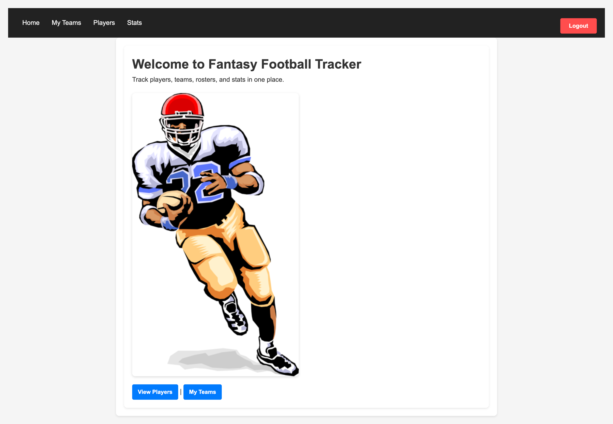
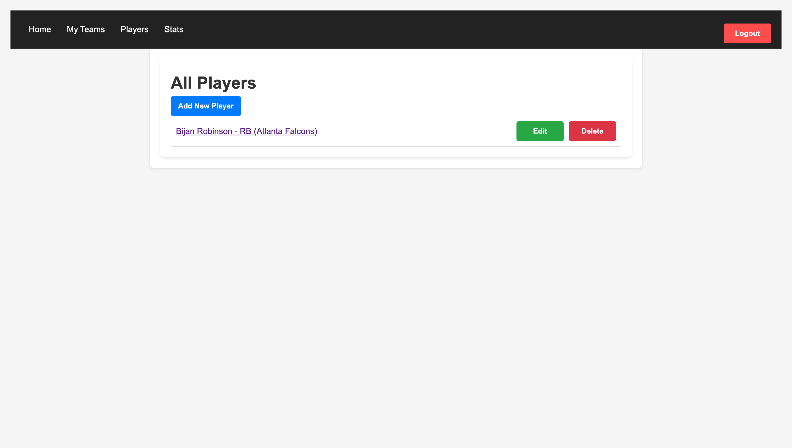
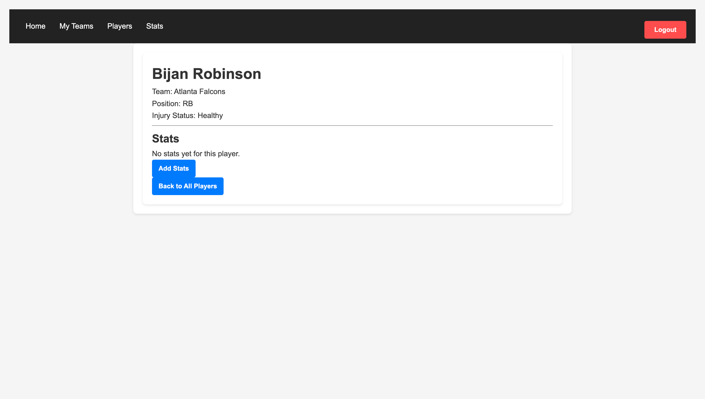
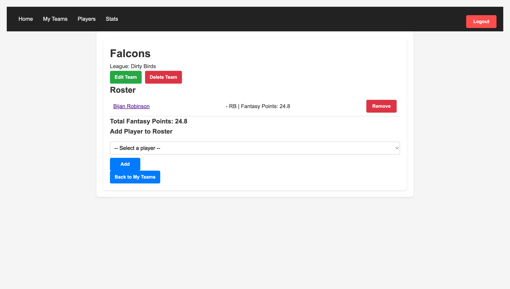
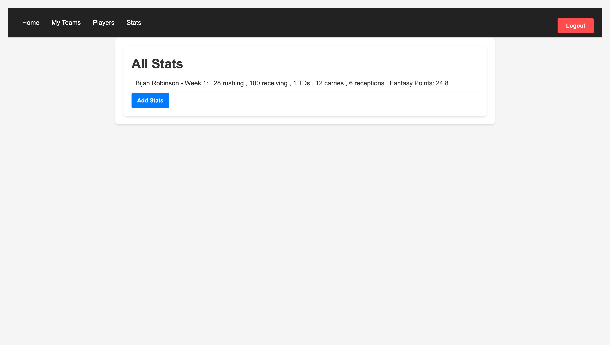

# Fantasy-Football-Tracker 🏈

This is an application to give fantasy football managers another way to keep track of their team/teams' stats week to week or over the course of a full season.  
All you have to do is create a player and add your player to the roster then insert stat lines for each player. Fantasy Points will be calculated automatically.

---

---

## 🚀 Deployment
- https://fantasy-football-tracker-xzre.onrender.com/  
- https://trello.com/b/RnJTHgyQ/my-trello-board

---

## 🛠️ Technologies Used
- Node.js  
- EJS  
- CSS  

---

## 🌟 Stretch Goals
Future enhancements of this application include:  
- Customizable league scoring settings  
- Live NFL stats integration through an API  
- Weekly player points projections

---

## 🙌 Attributions
Some coding guidance and suggestions were assisted by OpenAI's ChatGPT
